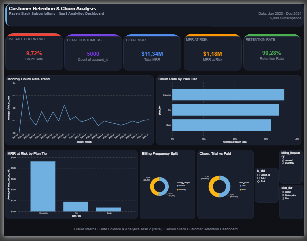
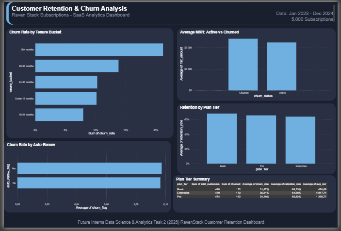
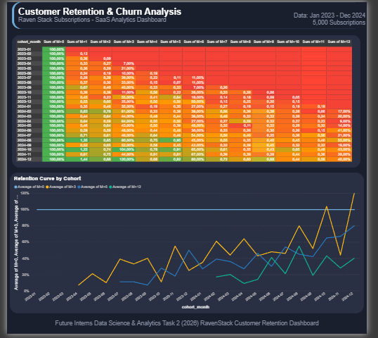

# 📊 Customer Retention & Churn Analysis
### Future Interns — Data Science & Analytics Task 2 (2026)

---

## 📌 Project Overview

This project analyzes customer retention and churn behavior for **RavenStack**, a SaaS subscription platform. The goal is to identify why customers leave, which segments are most at risk, and provide actionable recommendations to improve retention.

This analysis simulates real-world work done by data analysts in product, growth, and retention teams.

---

## 🎯 Business Problem

> *"Which customers are leaving, why are they leaving, and what can we do to keep them?"*

Key questions answered:
- What is the overall churn rate?
- Which plan tiers have the highest churn?
- At what stage of their lifetime do customers churn most?
- How much revenue is at risk from churned customers?
- Which cohorts show the strongest/weakest retention?

---

## 🛠️ Tools Used

| Tool | Purpose |
|---|---|
| **Python (Jupyter Notebook)** | Data cleaning, analysis, cohort calculations |
| **Pandas** | Data manipulation and transformation |
| **Matplotlib & Seaborn** | Exploratory visualizations |
| **Power BI** | Interactive dashboard and business storytelling |

---

## 📁 Project Structure

```
📦 Customer-Retention-Churn-Analysis
 ┣ 📓 customer_churn_analysis.ipynb         # Main analysis notebook
 ┣ 📊 cleaned_ravenstack_subscriptions.csv  # Cleaned dataset
 ┣ 📈 monthly_churn_trend.csv               # Monthly churn rates
 ┣ 📉 tenure_churn.csv                      # Churn by tenure bucket
 ┣ 💰 revenue_at_risk.csv                   # MRR at risk by plan tier
 ┣ 🔁 raven_cohort_retention_fixed.csv      # Cohort retention matrix
 ┣ 📋 plan_summary.csv                      # Plan tier summary metrics
 ┣ 🖼️ executive_summary.png                # Dashboard Page 1
 ┣ 🖼️ customer_segments.png                # Dashboard Page 2
 ┣ 🖼️ cohort_retention.png                 # Dashboard Page 3
 ┗ 📝 README.md
```

---

## 📊 Dashboard Preview

### Page 1 — Executive Summary


### Page 2 — Customer Segments


### Page 3 — Cohort Retention


---

## 🔍 Key Findings

| Metric | Value |
|---|---|
| Overall Churn Rate | **9.72%** |
| Retention Rate | **90.28%** |
| Total MRR | **$11.34M** |
| MRR at Risk | **$1.18M** |
| Total Customers | **5,000** |

### 📈 Churn by Plan Tier
- **Enterprise: 35.9%** — highest churn despite highest MRR ($4,918 avg)
- **Pro: 34.2%** — middle tier
- **Basic: 31.7%** — lowest churn rate

### ⏱️ Churn by Tenure
- **36+ months: 21.2%** — longest tenured customers churn the most
- **18-24 months: 7.95%** — most stable segment
- Customers at **30-36 months** show rising churn risk at 13.8%

### 💰 Revenue at Risk
- **Enterprise: $926,345** MRR at risk
- **Pro: $180,271** MRR at risk
- **Basic: $72,523** MRR at risk

---

## 💡 Recommendations

1. **🚨 Enterprise Retention Program** — Assign dedicated Customer Success Managers to Enterprise accounts. With $926K MRR at risk, even a 10% improvement saves $92K/month.

2. **⏰ Re-engage Long-Tenure Customers** — Customers at 36+ months churn at 21%. Introduce loyalty rewards, feature upgrades, or exclusive offers to re-engage them.

3. **📅 Promote Annual Billing** — Annual subscribers show slightly different churn patterns. Incentivize monthly customers to switch to annual plans with discounts.

4. **🆓 Improve Trial Onboarding** — Trial users churn at 10%, same as paid users. Invest in better onboarding flows to convert trials faster and reduce early drop-off.

5. **📊 Monitor 18-24 Month Customers** — This is the most stable segment. Understand what keeps them engaged and replicate it across other segments.

---

## 🚀 How to Run the Notebook

1. Clone the repository:
```bash
git clone https://github.com/yourusername/Customer-Retention-Churn-Analysis.git
```

2. Install required libraries:
```bash
pip install pandas numpy matplotlib seaborn
```

3. Open Jupyter Notebook:
```bash
jupyter notebook customer_churn_analysis.ipynb
```

4. Run all cells in order ✅

---

## 📢 Connect With Me

- 💼 [LinkedIn](https://www.linkedin.com/in/lehlogonolo-mpye-36252130b)
- 🐙 [GitHub](https://github.com/Chlowie-cyber)

---

*This project was completed as part of the Future Interns Data Science & Analytics Internship Programme (2026).*
